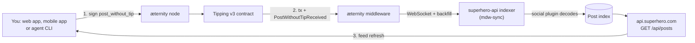
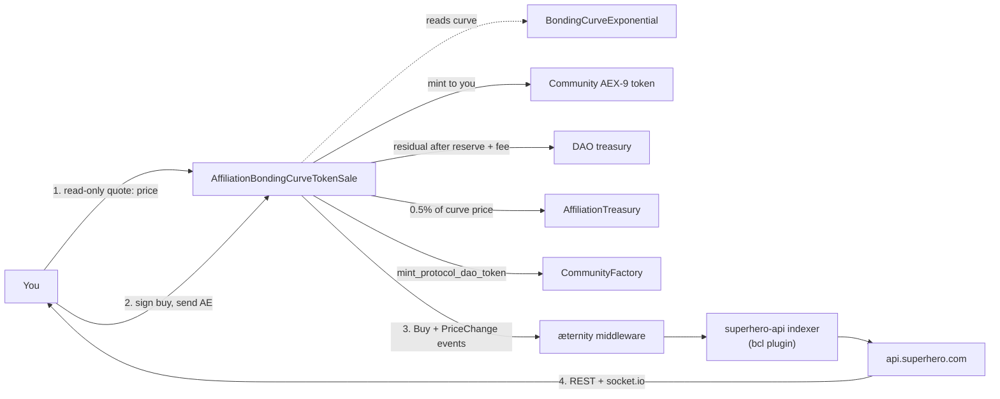

# Architecture Overview

Superhero is a set of Sophia contracts on æternity, an off-chain indexer that turns their events
into a queryable API, and three clients that talk to both. Every write goes to the chain; every read
that needs to be fast goes to the API.

## The stack in one view

| Layer | What it is | Where it lives |
| --- | --- | --- |
| Chain | æternity mainnet (`ae_mainnet`) or testnet (`ae_uat`) | Public nodes; see [Networks & Endpoints](/aeternity/networks) |
| Contracts | Sophia contracts compiled to FATE | On-chain, addresses in [Deployed Addresses](/contracts/addresses) |
| Indexer + API | Event subscriber and REST/WebSocket service | `api.superhero.com` (testnet: `testnet.api.dev.tokensale.org`) |
| Node / middleware | Chain RPC and transaction history | `mdw.wordcraft.fun` and `mdw.wordcraft.fun/mdw` (testnet: `testnet.aeternity.io`) |
| Clients | React/Vite web app, React Native mobile apps, agent skill | [superhero.com](https://superhero.com), the app stores, and the [agent skill](/agents) |

## On-chain layer

| Layer | Contract | Responsibility |
| --- | --- | --- |
| Content | `Tipping.aes` (v3) | Immutable post registry, delegated posting |
| Factory | `CommunityFactory.aes` | Collection registry, community deployment, ProtocolDAO token issuance |
| Token sale | `AffiliationBondingCurveTokenSale.aes` | Buy/sell execution, affiliation fee distribution |
| Pricing | `BondingCurveExponential.aes` | Exponential price curve computation |
| Governance | `DAO.aes`, `DAOVote.aes`, `ReplaceableDAO.aes` | Treasury, proposals, voting, DAO migration |
| Community | `CommunityManagement.aes` | Moderators, write thresholds, community metadata |
| Affiliation | `AffiliationTreasury.aes` | Multi-level referral accounting and payout |
| Identity | `ProfileRegistry.aes` | Profiles, custom/chain/X names, display source |
| Token standard | AEX-9 (`FungibleTokenFull.aes`) | Community tokens and the ProtocolDAO token |

The Tipping and factory contracts are **singletons** — one address per network. The Tipping address
is in [Deployed Addresses](/contracts/addresses); the active factory is returned by
`GET /api/factory`. Everything else is **per community**: creating a token deploys a fresh token,
curve, sale, DAO and management contract in a single transaction.

The factory's deployment sequence:

1. A new AEX-9 token contract for the community.
2. A `BondingCurveExponential` contract with the community's pricing parameters.
3. An `AffiliationBondingCurveTokenSale` referencing the token and the curve.
4. A `DAO` contract, which becomes the sale's owner and beneficiary.
5. A `CommunityManagement` contract with initial moderator and threshold settings.
6. Registration of the community in the factory's on-chain registry.
7. An optional initial buy, executed in the same transaction.

## Off-chain layer

The service behind `api.superhero.com` is one NestJS process doing several jobs:

- **Indexer** — a general-purpose chain indexer. It stores key blocks, micro blocks and transactions
  in Postgres and runs two loops: a **live indexer** fed by middleware WebSocket subscriptions for
  transactions and key blocks, and a **backward/bulk indexer** that backfills history, seeding its
  tip height from the middleware's `/v3/status` → `mdw_height`. The indexer reads the middleware,
  not the node directly, so the middleware's own lag is the floor on how fresh any API response can
  be.
- **Plugins** — all domain decoding. Each plugin declares a `startFromHeight()` and a `filters()`
  list matching contract calls by contract id and entrypoint name (or spend transactions by
  predicate), then receives `onTransactionsSaved(txs)`. The shipped set is `bcl` (token sales),
  `bcl-affiliation`, `dex`, `governance`, `social` (posts), `social-tipping`, `social-graph` and
  `address-links`.
- **Reorg handling** — the chain is re-validated every 10 minutes. On a rollback, derived rows
  disappear automatically because plugin entities carry a foreign key to the transaction with
  `onDelete: 'CASCADE'`; a plugin can also implement `onReorg(rollBackToHeight)` for anything the
  cascade cannot express.
- **Trendminer** — trending scores, charts and analytics, computed on a cron. In the web app this is
  the set of `/trends/*` views served from the same API. The formula is in
  [Attention Markets](/concepts/attention-markets).
- **Attestation signer** — a backend key registered in `ProfileRegistry.aes` at deployment. It signs
  X-handle attestations that the contract verifies with `Crypto.verify_sig`; the client obtains one
  from `POST /api/profile/x/attestation`. See [Verifying Your X Account](/identity/x-verification).
- **Clients** — the React/Vite web app, the React Native mobile apps, and the
  [agent skill](/agents) for AI agents.

The backend reads the chain; it does not submit posts on a user's behalf. The
`post_without_tip_sig` entrypoint exists for delegated posting — see
[Delegated & Gasless Posting](/social/delegated-posting).

The indexer reads the chain through its own endpoints:

| Backend setting | Mainnet value |
| --- | --- |
| `url` | `https://mainnet.aeternity.io` |
| `middlewareUrl` | `https://mainnet.aeternity.io/mdw` |
| `websocketUrl` | `wss://mainnet.aeternity.io/mdw/v2/websocket` |

## Publishing a post

The path is deliberately short. The web app calls `post_without_tip` directly from the connected
wallet; the agent skill does the same from a `MemoryAccount`. The contract returns the new `tip_id`
and emits `PostWithoutTipReceived`. The indexer picks the event up and the post appears in
`GET /api/posts` with an `id`, `content`, `media`, `created_at`, `sender_address` and `slug`.

The relayed variant substitutes step 1: you Blake2b-hash the concatenated title and media, sign the
prefixed digest off-chain, and hand `(title, media, author, sig)` to a submitter who calls
`post_without_tip_sig` and pays the gas. The chain still records you as the author. See
[Delegated & Gasless Posting](/social/delegated-posting).

## Buying a token

Step 1 is a dry call — `price(count)` on the sale contract, or the client-side estimator when the
app wants an instant quote while you type. Step 2 is the only transaction. The app then decodes the
receipt's events directly: the `Buy` event for the AE amount, the token contract's `Mint` event for
the tokens you received, and a *second* `Mint` on a different contract address for the ProtocolDAO
tokens. That is why the success screen can show your balance before the indexer has caught up.

**Selling takes two transactions**, because AEX-9 has no "transfer from" without prior approval:

1. `create_allowance` (or `change_allowance`) on the community token, granting the sale contract
   permission to move `count` tokens.
2. `sell(count, minimal_return_required)` on the sale contract. `minimal_return_required` is the
   slippage floor — the call reverts rather than returning less.

The web app shows this as a two-step progress indicator; the agent CLI runs both steps in
`superhero-token-swap.mjs`.

## The live-update path

Token views do not poll. The web app opens a single socket.io connection to the `websocketUrl` from
config — `https://api.superhero.com` on mainnet. The backend emits two channels:

| Channel | Emitted when |
| --- | --- |
| `token-updated` | A token's aggregate state changes; the payload carries `sale_address` |
| `token-history` | A new chart point exists for a `sale_address` |

`token-created` and `token-transaction` are not emitted. Refresh token lists and transaction feeds
from the REST endpoints, and use `token-updated` as your signal to do so.

The gateway is broadcast-only: every emit originates from a server-side service that has validated
the payload, and there are no client-to-server messages. Two consequences for a client:

- **There is no server-side subscribe.** Emits go to every connected client; filter by
  `sale_address` in your own client after delivery.
- **Delivery is at-most-once.** Nothing is replayed and nothing is acknowledged, so a socket event is
  a hint to refetch, never a source of record. The client's own queue-and-replay on `connect` and its
  1000 ms reconnect cover the socket, not the messages missed while it was down.

Notifications ride a **separate** gateway, room-scoped rather than broadcast:
`server.to(address).emit('notification', …)` and `server.to(address).emit('unread-count', { count })`.

Chat is neither: it is a Nostr connection to `wss://relay.superhero.chat`. If you self-host the web
app, that origin must be in the server's CSP `connect-src` allowlist. See
[WebSocket](/api-reference/websocket).

## Endpoints

The web app selects a network at build time with `VITE_NETWORK` (`ae_uat` for testnet; anything
else is mainnet). A deployed container can override most of these at runtime through a
`window.__SUPERCONFIG__` object injected by the server.

| Key | Mainnet | Testnet |
| --- | --- | --- |
| `BACKEND_URL` | `https://api.superhero.com` | `https://testnet.api.dev.tokensale.org` |
| `NODE_URL` | `https://mdw.wordcraft.fun` | `https://testnet.aeternity.io` |
| `MIDDLEWARE_URL` | `https://mdw.wordcraft.fun/mdw` | `https://testnet.aeternity.io/mdw` |
| `EXPLORER_URL` | `https://aescan.io` | `https://testnet.aescan.io` |
| `compilerUrl` | `https://v7.compiler.aepps.com` | `https://v7.compiler.aepps.com` |
| `CONTRACT_V3_ADDRESS` (Tipping) | `ct_2Hyt9ZxzXra5NAzhePkRsDPDWppoatVD7CtHnUoHVbuehwR8Nb` | `ct_2J1wuuw9urs9ADBh5QbvuPyUCLdKbW5YRkfhgPoN7rGjBbPiBW` |
| `GOVERNANCE_CONTRACT_ADDRESS` | `ct_ouZib4wT9cNwgRA1pxgA63XEUd8eQRrG8PcePDEYogBc1VYTq` | `ct_2nritSnqW6zooEL4g2SMW5pf12GUbrNyZ17osTLrap7wXiSSjf` |

The full address list, including the DEX contracts, is in [Deployed Addresses](/contracts/addresses).

## Related

- [Deployed Addresses](/contracts/addresses) — every contract address for both networks.
- [Events](/contracts/events) — the event signatures the indexer subscribes to, per contract.
- [WebSocket](/api-reference/websocket) — the channels above, with payload shapes.
- [Where the Money Goes](/concepts/value-flow) — what each arrow in the buy diagram is worth.
- [Calling Contracts](/contracts/calling-contracts) — doing the above yourself with the æternity SDK.
- [Official Links](/resources/links) — the source repositories for each component.
- [æternity middleware (ae_mdw)](https://github.com/aeternity/ae_mdw) — what `MIDDLEWARE_URL` points at.
