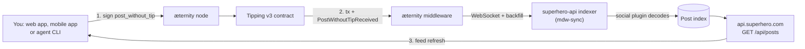
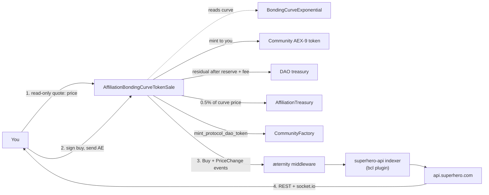

# Architecture Overview

Superhero is a set of Sophia contracts on æternity, an off-chain indexer that turns their events
into a queryable API, and three clients that talk to both. Every write goes to the chain; every read
that needs to be fast goes to the API. This page walks the whole stack and traces the two flows that
matter most — publishing a post and buying a token.

## The stack in one view

| Layer | What it is | Where it lives |
| --- | --- | --- |
| Chain | æternity mainnet (`ae_mainnet`) or testnet (`ae_uat`) | Public nodes; see [Networks & Endpoints](/aeternity/networks) |
| Contracts | Sophia contracts compiled to FATE | On-chain, addresses in [Deployed Addresses](/contracts/addresses) |
| Indexer + API | Event subscriber and REST/WebSocket service | `api.superhero.com` (testnet: `testnet.api.dev.tokensale.org`) |
| Node / middleware | Chain RPC and transaction history | `mdw.wordcraft.fun` and `mdw.wordcraft.fun/mdw` (testnet: `testnet.aeternity.io`) |
| Clients | React/Vite web app, React Native mobile apps, agent skill | [superhero.com](https://superhero.com), app stores, and the agent skill repository listed under [What is open source, and where](#what-is-open-source-and-where) |

## On-chain layer

| Layer | Contract | Responsibility |
| --- | --- | --- |
| Content | `Tipping.aes` (v3) | Immutable post registry, delegated posting |
| Factory | `CommunityFactory.aes` | Collection registry, community deployment, ProtocolDAO token issuance |
| Token sale | `AffiliationBondingCurveTokenSale.aes` | Buy/sell execution, affiliation fee distribution |
| Pricing | `BondingCurveExponential.aes` | Exponential price curve computation |
| Governance | `DAO.aes`, `DAOVote.aes`, `ReplaceableDAO.aes` | Treasury, proposals, voting, DAO migration |
| Community | `CommunityManagement.aes` | Moderators, write thresholds, community metadata |
| Affiliation | `AffiliationTreasury.aes` | Multi-level referral accounting and payout |
| Identity | `ProfileRegistry.aes` | Profiles, custom/chain/X names, display source |
| Token standard | AEX-9 (`FungibleTokenFull.aes`) | Community tokens and the ProtocolDAO token |

Two deployment facts follow from that table. The Tipping and factory contracts are **singletons** —
one address per network, fixed in `src/config.ts` as `CONTRACT_V3_ADDRESS` and fetched from
`GET /api/factory` respectively. Everything else is **per community**: creating a token deploys a
fresh token, curve, sale, DAO and management contract in a single transaction.

The factory's deployment sequence, from the whitepaper:

1. A new AEX-9 token contract for the community.
2. A `BondingCurveExponential` contract with the community's pricing parameters.
3. An `AffiliationBondingCurveTokenSale` referencing the token and the curve.
4. A `DAO` contract, which becomes the sale's owner and beneficiary.
5. A `CommunityManagement` contract with initial moderator and threshold settings.
6. Registration of the community in the factory's on-chain registry.
7. An optional initial buy, executed in the same transaction.

## Off-chain layer

The service behind `api.superhero.com` is **open source**: it is
[superhero-com/superhero-api](https://github.com/superhero-com/superhero-api), a NestJS application
distributed under the ISC licence (copyright BCTSL). Its internal name is `wordcraft-api` and its
Swagger document is titled "WORD CRAFT Scan", which is why several of its hostnames sit on
`wordcraft.fun` rather than on `superhero.com`.

It is one process doing several jobs:

- **Indexer** (`src/mdw-sync/`) — a general-purpose chain indexer, not an event listener bolted onto
  one contract. It stores key blocks, micro blocks and transactions in Postgres and runs two loops:
  a **live indexer** (`live-indexer.service.ts`) fed by middleware WebSocket subscriptions for
  transactions and key blocks, and a **backward/bulk indexer** (`indexer.service.ts`,
  `block-sync.service.ts`) that backfills history, seeding its tip height from
  `GET {MIDDLEWARE_URL}/v3/status` → `mdw_height`.
- **Plugins** (`src/plugins/`) — all domain decoding. Each plugin declares a `startFromHeight()` and
  a `filters()` list matching contract calls by contract id and entrypoint name (or spend
  transactions by predicate), then receives `onTransactionsSaved(txs)`. The shipped set is `bcl`
  (token sales), `bcl-affiliation`, `dex`, `governance`, `social` (posts), `social-tipping`,
  `social-graph` and `address-links`. `src/mdw-sync/README.md` documents the plugin contract.
- **Reorg handling** — `block-validation.service.ts` re-validates the chain every 10 minutes. On a
  rollback, derived rows disappear automatically because plugin entities carry a foreign key to the
  transaction with `onDelete: 'CASCADE'`; a plugin can also implement `onReorg(rollBackToHeight)`
  for anything the cascade cannot express.
- **Trendminer** — trending scores, charts and analytics, computed on a cron in `src/tokens/`
  (`update-trending-tokens.service.ts`). In the web app this is a set of views (`/trends/*`) served
  from the same API. The formula is documented in
  [Attention Markets](/concepts/attention-markets).
- **Attestation signer** — a backend key registered in `ProfileRegistry.aes` at deployment. It signs
  X-handle attestations that the contract verifies with `Crypto.verify_sig`; the client obtains one
  from `POST /api/profile/x/attestation`. See [Verifying Your X Account](/identity/x-verification).
- **Clients** — the React/Vite web app, the React Native mobile apps, and the
  [agent skill](/agents) for AI agents.

Two corrections to the picture the whitepaper paints:

**There is no posting relayer.** The whitepaper describes a backend that accepts a signed message
and submits it through `post_without_tip_sig`, but nothing in `superhero-api` signs or broadcasts a
post on a user's behalf — the backend reads the chain, it does not write posts to it. The contract
entrypoint is real and usable, and the sole reason posting is not gasless today is that no Superhero
service calls it. See [Delegated & Gasless Posting](/social/delegated-posting).

**The indexer reads the middleware, not the node directly** — so the middleware's own lag is the
floor on how fresh any API response can be.

**And it reads a different host than the web app does.** This is worth stating because the two are
easy to conflate: `mdw.wordcraft.fun` is a *client-side* node URL from `superhero/src/config.ts` and
appears nowhere in the backend. `superhero-api` has its own network table
(`src/configs/network.ts`) pointing at the æternity Foundation's public infrastructure:

| Backend setting | Mainnet value |
| --- | --- |
| `url` | `https://mainnet.aeternity.io` |
| `middlewareUrl` | `https://mainnet.aeternity.io/mdw` |
| `websocketUrl` | `wss://mainnet.aeternity.io/mdw/v2/websocket` |

So `api.superhero.com` indexes from `mainnet.aeternity.io` while the browser reads chain state
through `mdw.wordcraft.fun`. Both serve `ae_mainnet` and both see the same chain, but they are
independent dependencies that can lag independently — which is one more reason a socket event should
be treated as a hint rather than as a fact.

## Publishing a post

The path is deliberately short. The web app calls `post_without_tip` directly from the connected
wallet (`src/features/social/components/PostForm.tsx`); the agent skill does the same from a
`MemoryAccount` (`scripts/superhero-post.mjs`). The contract returns the new `tip_id` and emits
`PostWithoutTipReceived`. The indexer picks the event up and the post appears in `GET /api/posts`
with an `id`, `content`, `media`, `created_at`, `sender_address` and `slug`.

The relayed variant substitutes step 1: you Blake2b-hash the concatenated title and media, sign the
prefixed digest off-chain, and hand `(title, media, author, sig)` to a submitter who calls
`post_without_tip_sig` and pays the gas. The chain still records you as the author. See
[Delegated & Gasless Posting](/social/delegated-posting).

## Buying a token

Step 1 is a dry call — `price(count)` on the sale contract, or the client-side estimator in
`src/utils/bondingCurve.ts` when the app wants an instant quote while you type. Step 2 is the only
transaction. The app then decodes the receipt's events directly: it reads the `Buy` event for the AE
amount, the token contract's `Mint` event for the tokens you received, and a *second* `Mint` on a
different contract address for the ProtocolDAO tokens
(`src/features/trending/hooks/useTokenTrade.ts`). That is why the success screen can show your
balance before the indexer has caught up.

**Selling takes two transactions**, because AEX-9 has no "transfer from" without prior approval:

1. `create_allowance` (or `change_allowance`) on the community token, granting the sale contract
   permission to move `count` tokens.
2. `sell(count, minimal_return_required)` on the sale contract. `minimal_return_required` is the
   slippage floor — the call reverts rather than returning less.

The web app shows this as a two-step progress indicator; the agent CLI does it silently in
`scripts/superhero-token-swap.mjs`.

## The live-update path

Token views do not poll. `src/libs/WebSocketClient.ts` opens a single socket.io connection to the
`websocketUrl` from config — `https://api.superhero.com` on mainnet — and registers four channel
listeners. **Only two of them can ever fire.**
`superhero-api/src/tokens/token-websocket.gateway.ts` contains exactly two emits:

| Channel | Emitted when | Emitted by the backend? |
| --- | --- | --- |
| `token-updated` | A token's aggregate state changes; the payload carries `sale_address` | **Yes** — `handleTokenUpdated` |
| `token-history` | A new chart point exists for a `sale_address` | **Yes** — `handleTokenHistory` |
| `token-created` | A new community token is deployed | **No emit exists anywhere in the backend** |
| `token-transaction` | A buy or sell is indexed | **No emit exists anywhere in the backend** |

So a client subscribed to `token-created` or `token-transaction` will wait forever. Refresh token
lists and transaction feeds from the REST endpoints, and use `token-updated` as your signal to do
so.

**The gateway is broadcast-only, deliberately.** It defines no `@SubscribeMessage` handlers, and the
file says why: the gateway used to relay any client-sent message back to every connected client,
"which let anonymous callers poison the UI with fabricated prices/events". Every emit now originates
from a server-side service that has validated the payload. Two consequences for a client:

- **There is no server-side subscribe.** `server.emit` broadcasts to everyone; any per-`sale_address`
  filtering happens in your own client after delivery.
- **Delivery is at-most-once.** Nothing is replayed and nothing is acknowledged, so a socket event is
  a hint to refetch, never a source of record. The client's own queue-and-replay on `connect` and its
  1000 ms reconnect cover the socket, not the messages missed while it was down.

Notifications ride a **separate** gateway (`superhero-api/src/notifications/notifications.gateway.ts`)
with the same no-`@SubscribeMessage` rule, but room-scoped rather than broadcast:
`server.to(address).emit('notification', …)` and `server.to(address).emit('unread-count', { count })`.
The client side is `src/features/notifications/notification-feed-client.ts`.

Chat is neither: it is a Nostr connection to `wss://relay.superhero.chat`, whose origin must also
appear in the server's CSP `connect-src` allowlist or every socket dies at connect time. See
[WebSocket](/api-reference/websocket).

## What is open source, and where

| Component | Repository | Notes |
| --- | --- | --- |
| Web app | [superhero-com/superhero](https://github.com/superhero-com/superhero) | Linked from the app footer as "contribute on GitHub"; issues are the bug tracker |
| Indexer + API | [superhero-com/superhero-api](https://github.com/superhero-com/superhero-api) | NestJS, ISC licence. The service behind `api.superhero.com`; `src/mdw-sync/` is the indexer and `src/plugins/` the domain decoders |
| BCL contracts | [superhero-com/bcl-contracts](https://github.com/superhero-com/bcl-contracts) | The Sophia sources for the factory, sale, curve, DAO, community management and affiliation treasury. ISC licence, copyright BCTSL. The API's README also points at an upstream mirror, [bctsl/bctsl-contracts](https://github.com/bctsl/bctsl-contracts) |
| Tipping contract | [aeternity/tipping-contract](https://github.com/aeternity/tipping-contract) | `Tipping_v3.aes` and its getter contract — the post registry |
| Governance contracts | [aeternity/aepp-governance](https://github.com/aeternity/aepp-governance) | `Registry.aes` and `Poll.aes`, behind `/voting` |
| Agent skill | [superhero-com/superhero-agent-skill](https://github.com/superhero-com/superhero-agent-skill) | `SKILL.md`, guides, scripts and contract ACIs |
| æternity node, middleware, SDK | [github.com/aeternity](https://github.com/aeternity/aepp-sdk-js) | The chain layer, not maintained by Superhero |

The app's terms are explicit that the interface is open source and that "deployments may be operated
independently by community members" — a community-run instance talks to the same contracts but is
not the same service.

## Configuration you can rely on

Everything network-dependent is in one file, `src/config.ts`, branched at build time on
`VITE_NETWORK`.

| Key | Mainnet | Testnet |
| --- | --- | --- |
| `BACKEND_URL` | `https://api.superhero.com` | `https://testnet.api.dev.tokensale.org` |
| `NODE_URL` | `https://mdw.wordcraft.fun` | `https://testnet.aeternity.io` |
| `MIDDLEWARE_URL` | `https://mdw.wordcraft.fun/mdw` | `https://testnet.aeternity.io/mdw` |
| `EXPLORER_URL` | `https://aescan.io` | `https://testnet.aescan.io` |
| `compilerUrl` | `https://v7.compiler.aepps.com` | `https://v7.compiler.aepps.com` |
| `CONTRACT_V3_ADDRESS` (Tipping) | `ct_2Hyt9ZxzXra5NAzhePkRsDPDWppoatVD7CtHnUoHVbuehwR8Nb` | `ct_2J1wuuw9urs9ADBh5QbvuPyUCLdKbW5YRkfhgPoN7rGjBbPiBW` |
| `GOVERNANCE_CONTRACT_ADDRESS` | `ct_ouZib4wT9cNwgRA1pxgA63XEUd8eQRrG8PcePDEYogBc1VYTq` | `ct_2nritSnqW6zooEL4g2SMW5pf12GUbrNyZ17osTLrap7wXiSSjf` |

A deployed container can override most of these at runtime through a `window.__SUPERCONFIG__`
object injected by the server, so a running instance is not necessarily on the compiled-in defaults.
The full address list, including the DEX contracts, is in [Deployed Addresses](/contracts/addresses).

## Read more

- [Deployed Addresses](/contracts/addresses) — every contract address for both networks.
- [Events](/contracts/events) — the event signatures the indexer subscribes to, per contract.
- [WebSocket](/api-reference/websocket) — the four channels above, with payload shapes.
- [Where the Money Goes](/concepts/value-flow) — what each arrow in the buy diagram is worth.
- [Calling Contracts](/contracts/calling-contracts) — doing the above yourself with the æternity SDK.
- [Superhero whitepaper](https://superhero.com/whitepaper) — the "System Architecture" section.
- [æternity middleware (ae_mdw)](https://github.com/aeternity/ae_mdw) — what `MIDDLEWARE_URL` points at.
- [aepp-sdk-js](https://github.com/aeternity/aepp-sdk-js) — the SDK both the web app and the agent skill use.

## Open questions

- **Who operates `mdw.wordcraft.fun`, and under what commitment?** The backend's own deployment
  guide (`superhero-api/scripts/GUIDE.md`) pulls mainnet database backups from
  `root@dev.wordcraft.fun`, and the API's package name (`wordcraft-api`) and Swagger title
  ("WORD CRAFT Scan") share the brand — so the domain is almost certainly run by the same team
  rather than by a third party. What is not established anywhere is the availability commitment:
  no SLA, rate limit or maintenance policy for that host appears in any repository. Ask Superhero,
  or compare `GET /v3/status` against `mainnet.aeternity.io` to see whether it tracks upstream
  releases.
